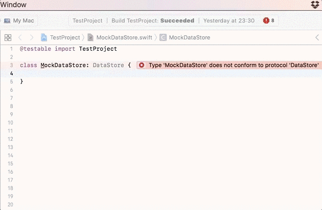

# Swift Mock Generator Xcode Source Editor Extension

An Xcode extension (plugin) to generate mock classes automatically.



[Looking for the AppCode version?](https://github.com/seanhenry/MockGenerator)

**IMPORTANT:**
- This plugin is in development and only supports a fraction of the features offered in the [AppCode plugin](https://github.com/seanhenry/MockGenerator).
- Only tested with Xcode 8.3.2 but will support Xcode 9 soon.

## Install Swift Mock Generator Xcode Source Editor Extension

- Download the latest release [here](https://github.com/seanhenry/SwiftMockGeneratorForXcode/releases)
- Copy the app to the `Applications` folder.
- Open the app
- Select the path to your project ([Why do I have to do this?](#why-do-i-have-to-set-a-path-to-my-project))
- Go to `System Preferences -> Extensions -> Xcode Source Editor` and make sure `Mock Generator` is enabled.
- Open Xcode

## How to create a new Swift mock

- Create an empty mock class conforming to a protocol.

Example:
```
class MyMock: MyProtocol {
}
```
- Place the cursor inside the class declaration.
- Click `Editor -> Mock Generator -> Generate Mock`.

## How to recreate a Swift mock

If you change the underlying protocol its mock will need to be regenerated.

To regenerate the mock, simply follow the steps above.

## Recommended: assign a shortcut

- Select preferences `⌘,` in Xcode.
- Choose 'Key Bindings'.
- Search for 'Mock Generator'.
- Choose your preferred shortcut. I prefer `⌃⌥⌘M`.

## Recommended: use source control

The mock generator will replace anything that is currently in your mock class with the generated mock.

Undo is supported for Xcode plugins but you're safer to use source control in the event of unexpectedly generating a mock.

## Features

| Feature | Xcode | AppCode
|---|---|---|
| Captures invocation status of methods.|✅|✅|
| Captures invocation status of properties.||✅|
| Captures invoked method parameters.||✅|
| Stubs values for your mocks to return.|✅|✅|
| Stubs a default value for return values where possible.||✅|
| Automatically calls closure parameters with stubbed values.||✅|
| Supports mocks conforming to one or many protocols.||✅|
| Handles overloaded method declarations.||✅|
| Regenerate your mock in one action.|✅|✅|
| Supports associated types.||✅|
| Supports parameter type-annotation attributes and inout.||✅|
| Respects public and open mocks and makes queries publicly available.||✅|
| Records multiple invocations of methods.|✅|✅|
| Records multiple invocations of method parameters.||✅|
| Generate mocks from protocols in 3rd party frameworks.||✅|
| Generate mocks from classes|||

## Feature requests

As shown above, the AppCode plugin is much more feature-rich. If there is a feature you need, check for an existing GitHub issue and make a comment or, if no issue exists, raise a new issue.

## Usage example

A protocol called Animator that we wish to mock:

```
protocol Animator {
    func animate(duration: TimeInterval, animations: () -> (), completion: (Bool) -> ()) -> Bool
}
```
Create a mock class conforming to a protocol:
```
class MockAnimator: Animator {
}
```
Generate the mock:

```
class MockAnimator: Animator {

    var invokedAnimate = false
    var invokedAnimateCount = 0
    var stubbedAnimateResult: Bool! = false

    func animate(duration: TimeInterval, animations: () -> (), completion: (Bool) -> ()) -> Bool {
        invokedAnimate = true
        invokedAnimateCount += 1
        return stubbedAnimateResult
    }
}
```
Inject the mock into the class you wish to test:

```
let mockAnimator = MockAnimator()
let object = ObjectToTest(animator: mockAnimator)
```
Test if animate method was invoked:

```
func test_mockCanVerifyInvokedMethod() {
    object.myMethod()
    XCTAssertTrue(mockAnimator.invokedAnimate)
}
```
Test the number of times animate was invoked:

```
func test_mockCanVerifyInvokedMethodCount() {
    object.myMethod()
    object.myMethod()
    XCTAssertEqual(mockAnimator.invokedAnimateCount, 2)
}
```
Stub a return value for the animate method:

```
func test_mockCanReturnAStubbedValue() {
    mockAnimator.stubbedAnimateResult = true
    let result = object.myMethod()
    XCTAssertTrue(result)
}
```

## Disable or remove the plugin

To disable:

Go to `System Preferences -> Extensions` and deselect the extension under `Xcode Source Editor`.

To remove:

Delete the app.

## Nomenclature

Despite being called a Mock Generator, this plugin actually generates something closer to a spy and stub. The word 'mock', whilst not technically correct, has been used because test doubles such as spies, mocks, and stubs have become colloquially known as mocks.

## Why do I have to set a path to my project?

The plugin uses SourceKit which needs a list of your Swift files to index.

You have to set the path to your code because there is no way to derive it from an Xcode extension.
